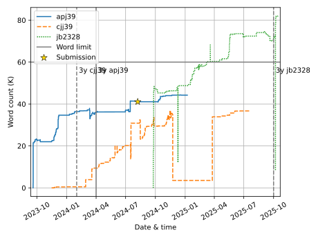

# Thesis-o-meter

A wordcount tracker for our PhD dissertations.



## Setup

This assumes that you have your dissertation on GitHub and can use actions.

Set up a workflow that calculates your dissertation's word count on push to the main branch.
It should then clone this repo, add a line to your personal csv file and push the change back.

An example github workflow:

```yaml
name: Wordcount

on:
  push:
    branches:
      - main

jobs:
  wordcount:
    concurrency: wordcount
    runs-on: ubuntu-22.04
    steps:
      - name: Checkout repository
        uses: actions/checkout@v3

      - name: Install Nix
        uses: DeterminateSystems/nix-installer-action@v9

      - name: Run the Magic Nix Cache
        uses: DeterminateSystems/magic-nix-cache-action@v3

      - name: Get the wordcount
        run: |
          # REPLACE WORDCOUNTING
          nix build .#wordcount

      - name: Checkout thesis-o-meter
        uses: actions/checkout@v3
        with:
          repository: jeffa5/thesis-o-meter
          ref: main
          path: thesis-o-meter
          ssh-key: ${{ secrets.DEPLOY_KEY }}

      - name: Submit the wordcount
        run: |
          wordcount=$(cat wordcount)
          datetime=$(date --rfc-3339=seconds | tr ' ' 'T')
          echo "$datetime,$wordcount"
          cd thesis-o-meter
          # REPLACE USER
          echo "$datetime,$wordcount" >> data/<user>.csv
          # REPLACE USER
          git add data/<user>.csv
          # make the commit appear to come from github actions in the GitHub UI
          git config user.name "github-actions[bot]"
          git config user.email "41898282+github-actions[bot]@users.noreply.github.com"
          # REPLACE USER
          git commit -m "Update <user> wordcount"
          # keep trying in the face of concurrent actions
          until git push; do git pull --rebase; done
```

With the corresponding basic nix flake:
```
{
  inputs = {
    flake-utils.url = "github:numtide/flake-utils";
  };
  outputs = { self, flake-utils, nixpkgs }:
    flake-utils.lib.eachDefaultSystem (system:
      let
      pkgs = nixpkgs.legacyPackages.${system};
      wordcount = pkgs.writeShellScriptBin "wordcount" ''
        wc -w dissertation.tex | sed 's/ .*$//'
      '';
      in
      {
        packages = { inherit wordcount; };
      }
    );
}
```

This assumes a deploy key is setup to give read and write access to the thesis-o-meter repo and the private key is set as a repository secret for the actions run in `DEPLOY_KEY`.

### Deploy key

The owner of the `thesis-o-meter` repo needs to add a public part of an ssh keypair under settings > deploy keys.
This keypair should be generated by the new user.
The private part of the keypair is what they use as the `DEPLOY_KEY` secret in their workflow (settings > secrets-and-variables > actions-secrets).

## CSV format

Each person should have a CSV file at `data/<crsid|gh_username>.csv`.
The format is:

```csv
datetime,wordcount
2023-09-19T09:19:20,200
2023-09-20T20:37:22,424
```

The `datetime` field is rfc3339 formatted.

## Historic context

https://web.archive.org/web/20060823213221/https://www.cl.cam.ac.uk/~akw27/thesisometer-explained.txt
